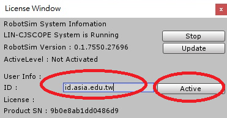

## KUKA工業機器手臂3D動畫模擬與操作

### 一、RobotSim基礎 [教學頁面](./1RobotSimBasic.html) 
1. RobotSim 執行環境 Unity [下載](https://store.unity.com/#plans-individual)
1.  機器手臂基本介紹
1. RobotSim模擬軟體 [討論區](http://forum.wtech.com.tw/viewforum.php?f=17&sid=4a42cdd8643e5518dd23f732ca23f0c4)
1.  RobotSim環境及基本操作
    - 下載 [連結](http://www.wtech.com.tw/public/download/robotsim/RobotSimExample_0_1_7550.unitypackage)
    - 試用帳號 id.asia.edu.tw
    - 啟用授權
 
    - 教點-程式-模擬  [參考影片](https://www.youtube.com/watch?v=4Gk7K88B10c&index=21&list=PLYLTPJkULAAZZuNW2s2tX-KWQOus7sAAo)
    - 設定Tool-更新點位-模擬動作  [參考影片](https://www.youtube.com/watch?v=NLA6A_qWDgs&index=22&list=PLYLTPJkULAAZZuNW2s2tX-KWQOus7sAAo)
    - 設定Base-設定手臂-匯出程式  [參考影片](https://www.youtube.com/watch?v=izkk5MW-FeY&index=23&list=PLYLTPJkULAAZZuNW2s2tX-KWQOus7sAAo)

1.  RobotSim基礎程式
    - 變數 Value
    - 動作 Motion
    - 流程控制 Flow

### 二、RobotSim專案制作 [教學頁面](./2RobotSimProject.html) 

1.  RobotSim完整專案
    - 自訂函式 顯示訊息功能
    - RobotSim程式設計擴充 夾娃娃機  [參考教學](https://yazelin.github.io/cnu2018-RobotSim/)

2.  RobotSim匯出 並匯入WorkVisual專案

<!--stackedit_data:
eyJoaXN0b3J5IjpbLTIwMjc5ODY5MDMsLTIwMTUwMDc0ODcsLT
E2MjQ5NjY0MzQsLTEzNTk5ODU2ODksLTE1Mzk0NDYxODNdfQ==

-->